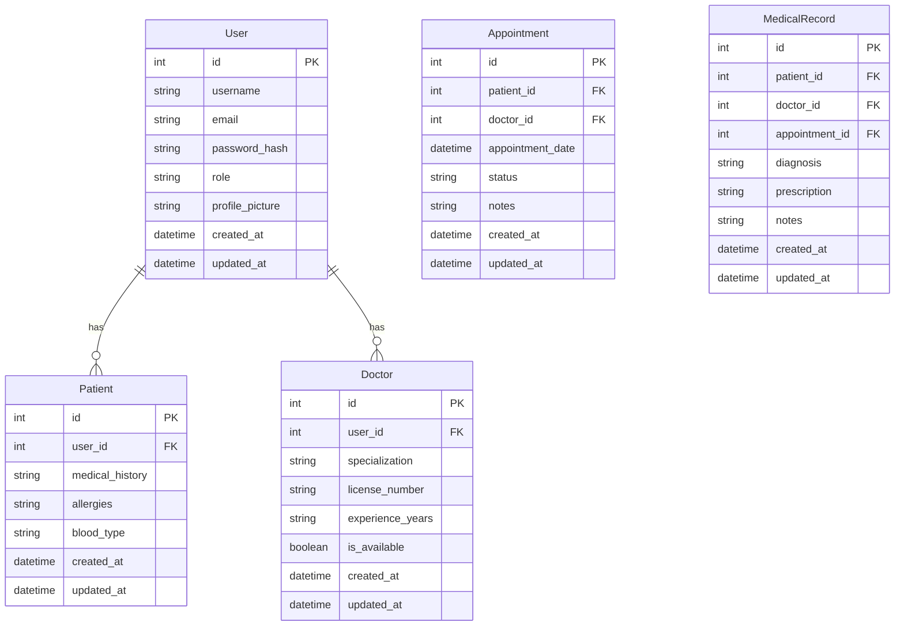
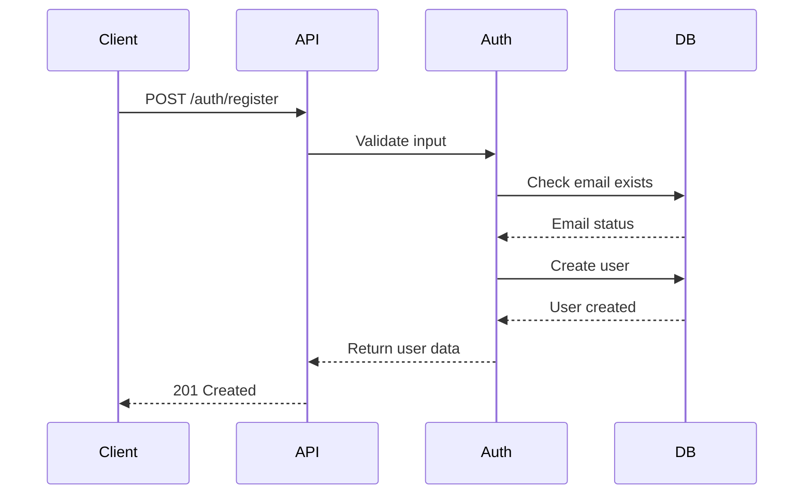
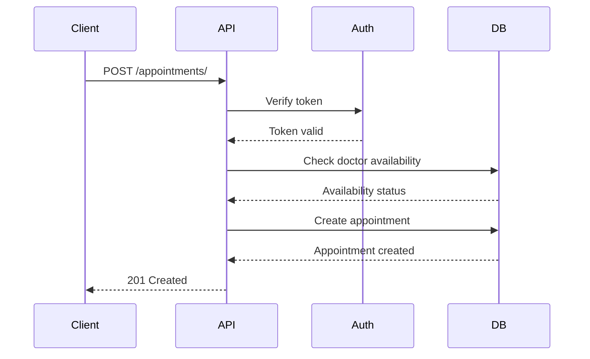
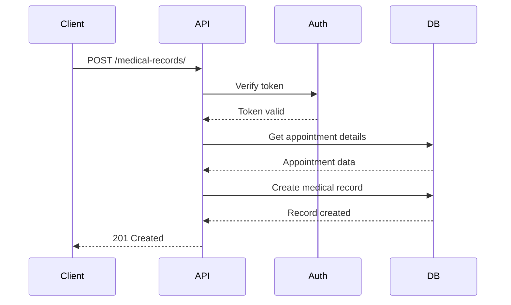

# 🏥 Healthcare Appointment Scheduling System

This project is a web-based system designed to streamline appointment scheduling in healthcare settings. It consists of a **Frontend** built with React and a **Backend** powered by FastAPI.

---

## 🏗️ Backend Architecture

### Component Organization

```
Backend/
├── app/
│   ├── models/                 # Database models
│   │   ├── user.py            # User model
│   │   ├── patient.py         # Patient model
│   │   ├── doctor.py          # Doctor model
│   │   ├── appointment.py     # Appointment model
│   │   └── medical_record.py  # Medical record model
│   │
│   ├── routes/                # API endpoints
│   │   ├── auth.py           # Authentication routes
│   │   ├── patient.py        # Patient routes
│   │   ├── doctor.py         # Doctor routes
│   │   ├── appointment.py    # Appointment routes
│   │   └── medical_record.py # Medical record routes
│   │
│   ├── schemas/              # Pydantic models for request/response
│   │   ├── auth.py          # Authentication schemas
│   │   ├── patient.py       # Patient schemas
│   │   ├── doctor.py        # Doctor schemas
│   │   ├── appointment.py   # Appointment schemas
│   │   └── medical_record.py # Medical record schemas
│   │
│   ├── utils/               # Utility functions
│   │   ├── auth.py         # Authentication utilities
│   │   └── validators.py   # Data validation utilities
│   │
│   └── main.py             # FastAPI application entry point
│
├── requirements.txt        # Python dependencies
└── .env                   # Environment variables
```

### Database Schema



### Key Process Sequence Diagrams

#### User Registration Process


#### Appointment Booking Process


#### Medical Record Creation Process


### Design Patterns and Principles

1. **Repository Pattern**
   - Each model has its own repository class
   - Encapsulates database operations
   - Provides clean interface for data access

2. **Dependency Injection**
   - FastAPI's dependency injection system
   - Used for authentication and database access
   - Promotes loose coupling

3. **Data Transfer Objects (DTOs)**
   - Pydantic models for request/response
   - Input validation and serialization
   - Clear API contracts

4. **Middleware**
   - CORS handling
   - Authentication
   - Error handling
   - Request logging

5. **Error Handling**
   - Centralized error handling
   - Custom exception classes
   - Consistent error responses

### Security Measures

1. **Authentication**
   - JWT-based authentication
   - Token expiration
   - Role-based access control

2. **Data Protection**
   - Password hashing
   - Input validation
   - SQL injection prevention
   - XSS protection

3. **API Security**
   - Rate limiting
   - CORS configuration
   - HTTPS enforcement

---

## 🚀 Project Setup Instructions

Follow these steps to get the project up and running on your local machine.

### 📦 Prerequisites

- Python 3.8 or higher
- Node.js 14 or higher
- PostgreSQL
- Git

### 🔧 Database Setup

1. Install PostgreSQL if you haven't already
2. Create a new database:
```sql
CREATE DATABASE healthcare_db;
```

### 🖥️ Backend Setup (FastAPI)

1. Navigate to the backend directory:
```bash
cd Backend
```

2. Create and activate a virtual environment:
```bash
# Windows
python -m venv venv
venv\Scripts\activate

# Linux/Mac
python3 -m venv venv
source venv/bin/activate
```

3. Install the required packages:
```bash
pip install -r requirements.txt
```

4. Create a `.env` file in the Backend directory with the following content:
```env
DB_USER=postgres
DB_PASSWORD=your_password
DB_HOST=localhost
DB_PORT=5432
DB_NAME=healthcare_db
```

5. Start the FastAPI server:
```bash
uvicorn app.main:app --reload
```

The backend will be available at http://localhost:8000.

### 🎨 Frontend Setup (React)

1. Navigate to the frontend directory:
```bash
cd FrontEnd
```

2. Create a `.env` file with the following content:
```env
REACT_APP_SERVER_DOMAIN=http://localhost:8000
REACT_APP_API_BASE_URL=http://localhost:8000
REACT_APP_CLOUDINARY_BASE_URL=your_cloudinary_url
REACT_APP_CLOUDINARY_CLOUD_NAME=your_cloud_name
REACT_APP_CLOUDINARY_PRESET=your_upload_preset
```

3. Install the dependencies:
```bash
npm install
```

4. Start the development server:
```bash
npm start
```

The frontend will be available at http://localhost:3000.

### 🔑 API Endpoints

#### Authentication
- POST `/auth/register` - Register a new user
- POST `/auth/login` - Login with role
- POST `/auth/token` - Get access token
- GET `/auth/user/getuser/{user_id}` - Get user details

#### Patients
- GET `/patients/` - Get all patients
- POST `/patients/` - Create patient
- GET `/patients/{patient_id}` - Get patient
- PUT `/patients/{patient_id}` - Update patient
- DELETE `/patients/{patient_id}` - Delete patient

#### Doctors
- GET `/doctors/` - Get all doctors
- POST `/doctors/` - Create doctor
- GET `/doctors/{doctor_id}` - Get doctor
- PUT `/doctors/{doctor_id}` - Update doctor
- DELETE `/doctors/{doctor_id}` - Delete doctor

#### Appointments
- GET `/appointments/` - Get all appointments
- POST `/appointments/` - Create appointment
- GET `/appointments/{appointment_id}` - Get appointment
- PATCH `/appointments/{appointment_id}/status` - Update appointment status

#### Medical Records
- GET `/medical-records/` - Get all medical records
- POST `/medical-records/` - Create medical record
- GET `/medical-records/{record_id}` - Get medical record

### 🛠️ Tech Stack

- **Frontend**: React, JavaScript, Axios
- **Backend**: FastAPI, Python, Tortoise ORM
- **Database**: PostgreSQL
- **Authentication**: JWT
- **File Storage**: Cloudinary
- **Server**: Uvicorn

### 📚 Documentation

- Backend API documentation is available at http://localhost:8000/docs
- Frontend code is organized in the `FrontEnd/src` directory
- Backend code is organized in the `Backend/app` directory

### 🔍 Testing

1. Backend tests:
```bash
cd Backend
pytest
```

2. Frontend tests:
```bash
cd FrontEnd
npm test
```